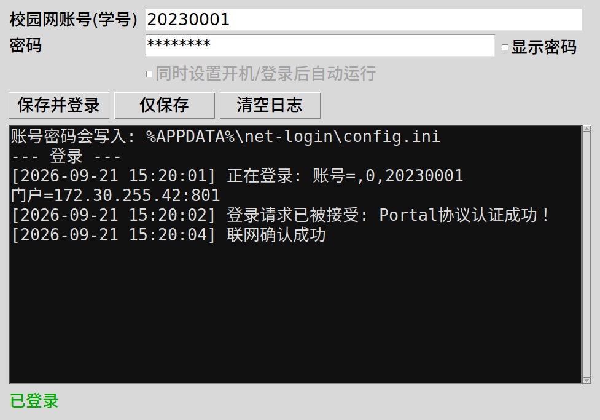

# 校园网自动登录 (深圳大学 / Dr.COM eportal)

开机后自动检查网络：已认证就什么都不做，没认证就自动登录；守护运行期间掉线也会自动重连。
纯 Python 标准库实现，不需要安装任何第三方依赖。

## 文件说明

| 文件 | 作用 |
| --- | --- |
| `auto-login.py` | 主脚本（联网检测 / 登录 / 守护重连） |
| `config.example.ini` | 配置模板（安装时会复制成 `config.ini` 再填账号密码） |
| `install.sh` | Linux：一键安装 / 卸载 systemd 服务 |
| `install-macos.sh` | macOS：一键安装 / 卸载 launchd 服务 |
| `install-windows.ps1` | Windows：一键安装 / 卸载任务计划程序 |
| `install-windows.bat` | Windows：**双击运行**，装好自启并打开下面的图形界面 |
| `windows-setup.pyw` | Windows：图形界面，填账号密码 → 保存 → 立即登录 |
| `preview-windows-gui.png` | Windows 图形界面预览图 |
| `netlogin.service` | Linux 用户级服务模板（登录桌面后运行） |
| `netlogin-system.service` | Linux 系统级服务模板（开机即运行） |

## 三步搞定

```bash
cd net-login
./install.sh                 # 安装（用户级，不需要 sudo）
nano ~/.config/net-login/config.ini   # 填 username（学号）和 password
/usr/bin/env python3 ~/.local/bin/net-login.py login --verbose   # 试一次
```

装好后就是开机自动运行了，平时不用管。日志：

```bash
journalctl --user -u netlogin -f
```

`config.ini` 每轮检查都会重新读取，改完立即生效，不用重启服务。

## 适用网络

深大校园网的 Dr.COM 认证门户：`http://172.30.255.42/`（认证接口在 801 端口）。
脚本按门户实际下发的方式登录，等价于浏览器点“登录”：

```
GET http://172.30.255.42:801/eportal/portal/login
    ?login_method=1&user_account=,0,<学号>&user_password=<密码>
    &wlan_user_ip=<本机IP>&wlan_user_mac=000000000000&terminal_type=1&jsVersion=4.1.3
```

其中 `,0,` 前缀、`login_method`、端口都是脚本向门户查询后自动确定的（`discover` 命令可以看到）。

## 命令

```bash
net-login.py check               # 输出 online / offline，退出码 0/1，适合被别的脚本调用
net-login.py check --verbose     # 带详细原因的检查
net-login.py login               # 登录一次；已在线则跳过
net-login.py login --dry-run     # 只打印将要发出的请求，不真正登录
net-login.py watch               # 常驻守护，掉线自动重连（服务就是用这个）
net-login.py status              # 查看门户记录的在线状态、已用流量
net-login.py discover            # 自动发现认证门户地址（换网段后用）
net-login.py logout              # 注销当前账号
```

常用参数：`-c 配置文件`、`--verbose`。

## 开机自启的两种方式

- **用户级（默认，不需要 sudo）**：`./install.sh`。登录桌面后启动；服务常驻，掉线自动重连。
  想让它在没人登录时也运行（比如远程 SSH 前就想好网络）：
  ```bash
  sudo loginctl enable-linger $USER
  ```
- **系统级（开机即运行，需要 sudo）**：`sudo ./install.sh --system`
  ```bash
  sudo nano /etc/net-login/config.ini
  systemctl status netlogin
  ```

## 跨平台（Windows / macOS）

脚本本体是纯 Python 标准库 + HTTP，**三个系统通用**：联网检测、门户发现、登录请求、重试逻辑一行都不用改。
只有两处必须按系统适配，已经处理好了：

| | Linux | macOS | Windows |
| --- | --- | --- | --- |
| 自启动 | systemd | launchd | 任务计划程序 |
| 安装命令 | `./install.sh` | `./install-macos.sh` | `./install-windows.ps1` |
| 配置文件位置 | `~/.config/net-login/config.ini` | `~/Library/Application Support/net-login/config.ini` | `%APPDATA%\net-login\config.ini` |
| 日志 | `journalctl --user -u netlogin -f` | `tail -f ~/Library/Logs/netlogin.log` | `Get-Content $env:APPDATA\net-login\netlogin.log -Wait` |

**Windows**（需要先装 Python 3，安装时勾选 Add python.exe to PATH）—— 最简单的方式是**双击 `install-windows.bat`**：
它会装好开机自启并弹出图形界面，你只要填学号/密码，点“保存并登录”，剩下全自动。



命令行方式：

```powershell
powershell -ExecutionPolicy Bypass -File .\install-windows.ps1
python $env:LOCALAPPDATA\net-login\net-login.py login --verbose
```

图形界面（也可单独运行 `windows-setup.pyw`）：填账号密码 → 勾选是否设置开机自启 → “保存并登录”；
过程日志实时显示在窗口里，成功后弹提示。账号密码写在 `%APPDATA%\net-login\config.ini`。

- 默认是“登录 Windows 后自动运行”；要开机即运行（还没登录也运行）用管理员 PowerShell：`-AtStartup`。
- 用 `pythonw.exe` 后台运行不弹黑框，日志写进 `netlogin.log`。
- 如果 Windows 上装了**哆点 / Dr.COM 客户端**，建议退出它，避免两边互相抢会话。

**macOS**：

```bash
cd net-login
./install-macos.sh                              # 用户级
open -e "$HOME/Library/Application Support/net-login/config.ini"
~/.local/bin/net-login.py login --verbose
```

- 系统级（开机即运行）用 `sudo ./install-macos.sh --system`；没有 python3 先 `xcode-select --install`。
- 睡眠唤醒后掉线也没关系，守护进程会自动重登。

**代码里为跨平台做的改动**：配置目录按系统取默认值；桌面通知分平台（`notify-send` / `osascript` / Windows 气泡）；
`--log-file` 参数把日志同时写文件（Windows 无控制台）；控制台编码兜底（Windows 的 GBK 控制台不会因中文报错）。
登录协议部分三个系统完全一致，所以 Linux 上实测通过的结论对另外两个系统同样成立。

## 检测与登录逻辑

1. **以门户的会话状态为准**：查询门户 `/drcom/chkstatus`，`result=1` 才算已认证。
   不能只靠外网探针判断：校园网 IPv6 免认证就通，会出现“探针通、但 IPv4 上不了网”的假在线，
   脚本会因此漏掉登录（这也是本脚本早期版本踩过的坑）。
2. 门户不可达时（例如连的是手机热点）才回退到外网探针，且探针**强制走 IPv4**。
3. 判定未认证 → 查询门户配置 → 按门户要求拼装登录请求 → 2 秒后复检确认。
4. 失败自动重试：这个门户在注销后几秒内会对登录接口回 `503`，属于限流，退避重试即可成功。
5. 门户提示“已经在线”视为登录成功（同一 IP 重复登录的正常表现）。
6. 账号/密码错误、欠费停机这类问题不重试，改为暂停 `auth_error_interval` 秒，避免反复试触发账号锁定。

实测（2026-09-21）：注销后门户返回 `Portal协议注销成功`，脚本 12 秒内重新登录成功并复检通过
（其中一次是门户 503 限流，退避 8 秒后重试成功）。

## 安全边界（重要）

最早的版本有个真实漏洞：**连上别的需要认证的网络时，脚本可能把校园网账号密码发给对方**。

- 攻击路径：换到酒店/其他学校/伪造热点的网络 → 外向探针失败 → 脚本自动“发现”那个网络的门户 →
  如果对方也是 Dr.COM（国内很常见），就按同样的接口把账号密码提交过去。
- 实测复现：本地起一个假门户，未加固版本自动发现它并发出
  `user_account=,0,TESTUSER  user_password=TESTPASS`；抓包/日志里就是明文。

现在加了三层防护（`config.ini` 的 `[security]`）：

1. **本机 IP 必须在 `allow_cidrs` 内**（默认 `172.30.0.0/16`）——连咖啡厅 WiFi、用手机热点时直接不动手。
2. **门户地址也必须在 `allow_cidrs` 内**——即使自动发现了一个陌生门户，也不会给它提交任何凭据。
3. **门户特征校验 `expect_keywords`**（默认 `szu`）：门户响应里必须出现本校门户的特征串，否则放弃登录。

任何一条不满足，脚本只会在日志里说“当前不在校园网，已暂停自动登录”，不会发送账号密码。
加固前后的对比已经实测：同一个假门户，加固后没有任何凭据发出。

仍然存在的边界（知道了就不慌）：

- 校园门户本身是 **HTTP 明文**，密码在校园网内是明文传输的 —— 这是学校门户的现状，脚本改不了（所以不要在不可信的网络上手动登录门户）。
- 密码以明文存在 `config.ini`，权限 600 / 仅当前用户可读。
- 若某个网络恰好也用 `172.30.0.0/16` 且门户里带 `szu` 字样，仍可能误判（概率极低）。想更严格可以把
  `allow_cidrs` 收紧成 `172.30.36.0/24`（你实际所在的网段），或关闭自动发现、把 `[portal] host` 写死。

## 性能开销（实测）

在 Linux 上跑了 60 秒采样（在线状态下，每 15 秒一轮检查）：

| 指标 | 实测值 | 说明 |
| --- | --- | --- |
| CPU | **3 ms / 60 秒**（约 0.005% 单核） | 几乎全是等待网络 |
| 内存 | RSS ≈ 20 MB（cgroup ≈ 10 MB） | Python 解释器本身的开销，占个大头 |
| 线程数 | 1 | 单线程 sleep 循环，无忙等 |
| 唤醒 | 6 次 / 30 秒 | 每轮 1 次网络请求 + 1 次定时器 |
| 单次检查 | 0.2 秒（其中 HTTP 9.5 ms） | 校园网内只发 1 个请求 |
| 流量 | 约 1 KB / 次 → 每 15 秒一次 ≈ **5 MB/月** | 门户返回 820 字节 |

掉线时才多几次探针请求；登录失败会退避重试，不会持续占用 CPU 或猛打门户。
想更省可以调大 `interval`（比如 60 秒），代价是掉线后恢复变慢。

## 常见问题

- **一直提示“config.ini 里还没填 username / password”**：还没填账号密码，或文件在别处。
  用 `net-login.py -c <路径> check --verbose` 确认读的是哪个文件。
- **登录失败并提示“账号或密码错误”**：密码改了、或账号欠费停机，先用浏览器登一次确认。
- **换了宿舍/网段后登录失败**：门户地址变了，执行 `net-login.py discover` 把新的 host 填进 `config.ini`；
  也可以把 `[portal] host` 留空，让脚本每次都自动发现。
- **门户提示需要验证码 / 密码加密认证**：说明网络换了认证方案，脚本会明确报错，此时把报错发我可以再适配。
- **想临时停掉**：`systemctl --user stop netlogin`（再开 `start`）。
- **务必注意**：密码以明文存在 `config.ini`（权限 600，仅本人可读）。

## 卸载

```bash
./install.sh --uninstall              # 用户级
sudo ./install.sh --uninstall --system   # 系统级
```
配置文件会保留，需要可自行删除。
